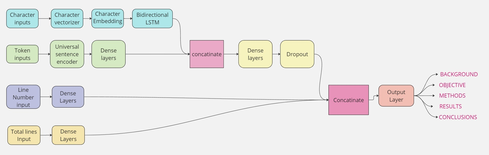
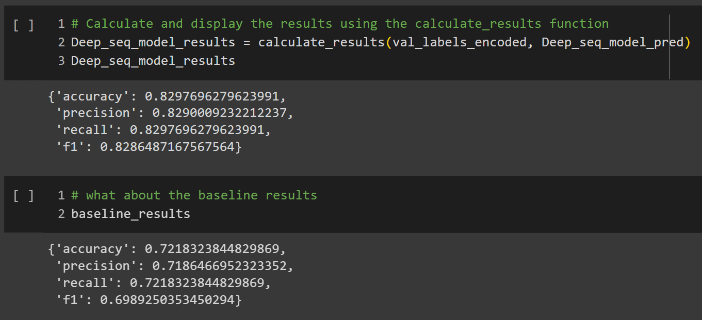

# Skimlit: NLP Model for Sentence Classification in Paper Abstracts

- [Skimlit: NLP Model for Sentence Classification in Paper Abstracts](#skimlit-nlp-model-for-sentence-classification-in-paper-abstracts)
  - [Project Overview 🌐](#project-overview-)
  - [Dependencies 🛠️](#dependencies-️)
  - [Data 📊](#data-)
  - [Model Architecture 🏗️](#model-architecture-️)
  - [Training 🚀](#training-)
  - [Evaluation 📈](#evaluation-)
  - [Results 🎉](#results-)
  - [Usage 🚀](#usage-️)

## Project Overview 🌐

In this NLP project, I endeavored to replicate the paper "Neural Networks for Joint Sentence Classification in Medical Paper Abstracts" using the PubMed 200k RCT dataset. Leveraging my skills in the NLP field and knowledge of TensorFlow, I aimed to create an NLP model capable of classifying abstract sentences into specific roles (e.g., objective, methods, results) to facilitate efficient literature skimming for researchers.

## Dependencies 🛠️

[!Google Colab (for utilizing free GPUs)](https://img.shields.io/badge/-Google%20Colab-F9AB00?style=for-the-badge&logo=google-colab&logoColor=white&labelColor=F9AB00)](#)

## Data 📊

I utilized the "PubMed 200k RCT dataset" from [GitHub](https://github.com/Franck-Dernoncourt/pubmed-rct). Due to time and resource constraints, I focused on the "20k RCT dataset" subset.

## Model Architecture 🏗️

- **Token Inputs:**
  - String tokens
  - Token embeddings using a pre-trained embedding layer (e.g., TensorFlow Hub)
  - Dense layer with ReLU activation (128 units)

- **Char Inputs:**
  - String characters
  - Character vectorization
  - Character embedding
  - Bidirectional LSTM layer with 32 units

- **Line Numbers Inputs:**
  - Integer sequence representing line numbers (15 elements)
  - Dense layer with ReLU activation (32 units)

- **Total Lines Inputs:**
  - Integer sequence representing total lines (20 elements)
  - Dense layer with ReLU activation (32 units)

- **Hybrid Embedding:**
  - Concatenation of outputs from the token and char models
  - Dense layer with ReLU activation (256 units)
  - Dropout layer with a dropout rate of 0.5

- **Tribrid Embedding:**
  - Concatenation of outputs from line number, total line, and hybrid embeddings

- **Output Layer:**
  - Dense layer with softmax activation (5 units) for multi-class classification

- **Overall Model:**
  - Constructed by specifying inputs and outputs for line number, total line, token, and char models.

## Training 🚀

I trained a TF-IDF Multinomial Naive Bayes model as a baseline. Subsequently, I trained the deep learning model described in the architecture above.

## Evaluation 📈

## Results 🎉

## Usage 🚀

To run the code:
1. Clone the repository: `https://github.com/mouraffa/Skimlit-NLP-Model-for-Sentence-Classification-in-Paper-Abstracts.git`
2. Open the notebook in Google Colab: `Skimlit_NLP_Model_for_Sentence_Classification_in_Paper_Abstracts.ipynb`
3. Follow the instructions within the notebook to execute the code.

Feel free to reach out for questions or collaboration! 🤝
 - Mouraffa youssef
 - Mouraffayoussef@gmail.com
 - [My LinkedIn Profile](https://www.linkedin.com/in/youssef-mouraffa-316663201/)
